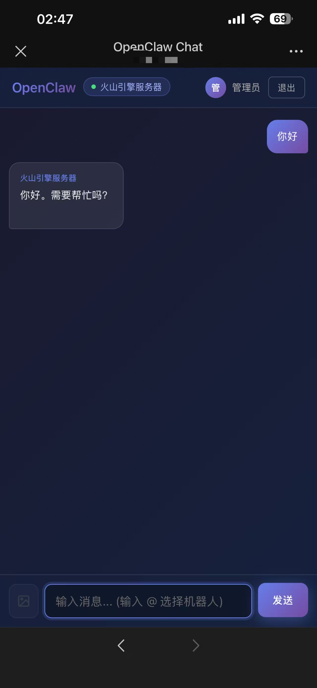

# OpenClaw Nexus

[](https://www.npmjs.com/package/@houchenyang/nexus-gateway)
[](https://github.com/hcy050617/openclaw-nexus)
[](https://opensource.org/licenses/MIT)

中文 | [English](./README_EN.md)

AI 对话转发网关 - 解决国内企业级 IM 应用额度限制问题。

## 预览




## 痛点

在国内使用 AI 助手对接企业级 IM（如飞书、钉钉、企业微信）时，常常面临：

- **API 调用额度限制** - 各平台对机器人消息有频率限制
- **多平台重复开发** - 每个平台需要单独对接
- **会话管理困难** - 无法统一管理多个 AI 机器人

## 解决方案

OpenClaw Nexus 提供了一个统一的网关层：

```
飞书/钉钉/企业微信          OpenClaw Nexus Gateway          AI 服务
       用户  ─────────>  [认证 + 转发 + 负载均衡]  ─────────>  Bot
```

## 项目结构

```
nexus/
├── nexus-gateway/        # 网关服务端
│   ├── src/
│   │   ├── index.ts      # 主入口，Express + WebSocket 服务
│   │   ├── config.ts     # 配置加载
│   │   ├── session.ts    # 用户会话管理
│   │   ├── bot-manager.ts # Bot 连接管理
│   │   └── types.ts      # 类型定义
│   ├── public/           # Web 聊天界面
│   └── config.json       # 配置文件
├── extensions/nexus/     # OpenClaw 客户端插件
│   └── src/
│       ├── channel.ts    # Channel 插件定义
│       ├── bot.ts        # 消息处理
│       ├── monitor.ts    # WebSocket 连接监控
│       ├── outbound.ts   # 出站适配器
│       ├── probe.ts      # 连接探测
│       ├── reply-dispatcher.ts # 回复分发器
│       ├── runtime.ts    # 运行时管理
│       ├── send.ts       # 发送消息
│       ├── accounts.ts   # 账户解析
│       └── types.ts      # 类型定义
└── web-chat/             # 独立 Web 聊天页面
```

## 特性

- **用户认证** - 基于 Token 的会话管理，支持多用户
- **多 Bot 管理** - 支持多个 AI Bot 同时在线，自动负载均衡
- **流式输出** - 支持 SSE 流式响应，实时显示 AI 回复
- **图片消息** - 支持发送和接收图片消息（base64 格式）
- **Web 界面** - 内置 Markdown 渲染、代码高亮的聊天界面
- **心跳保活** - 自动检测 Bot 在线状态，超时自动断开
- **负载均衡** - 自动分发请求到可用 Bot
- **自动重连** - 客户端插件支持断线自动重连

---

## 网关服务端 (nexus-gateway)

### 安装

```bash
# 方式一：全局安装
npm install -g @houchenyang/nexus-gateway
nexus-gateway

# 方式二：npx 直接运行
npx @houchenyang/nexus-gateway

# 方式三：源码运行
git clone https://github.com/hcy050617/openclaw-nexus.git
cd openclaw-nexus/nexus-gateway
pnpm install && pnpm build
pnpm start
```

### 配置

首次启动会在当前目录自动创建 `config.json`：

```json
{
  "port": 17392,
  "sessionTTL": 86400000,
  "pingInterval": 30000,
  "botTimeout": 90000,
  "botToken": "your-secret-token",
  "users": {
    "admin": {
      "password": "admin123",
      "displayName": "管理员"
    },
    "user1": {
      "password": "password1",
      "displayName": "用户1"
    }
  }
}
```

| 字段 | 类型 | 默认值 | 说明 |
|------|------|--------|------|
| `port` | number | 17392 | 服务端口 |
| `sessionTTL` | number | 86400000 | 用户会话有效期（毫秒），默认 24 小时 |
| `pingInterval` | number | 30000 | Bot 心跳间隔（毫秒） |
| `botTimeout` | number | 90000 | Bot 超时时间（毫秒） |
| `botToken` | string | "" | Bot 连接认证令牌，留空则不校验 |
| `users` | object | - | Web 用户账号配置 |

### 后台运行

#### 使用 PM2（推荐）

```bash
# 安装 pm2
npm install -g pm2

# 在工作目录下启动（重要：必须在 config.json 所在目录执行）
cd /your/nexus-gateway
pm2 start $(which nexus-gateway) --name nexus

# 管理命令
pm2 status              # 查看状态
pm2 logs nexus          # 查看日志
pm2 stop nexus          # 停止
pm2 restart nexus       # 重启
pm2 save && pm2 startup # 开机自启
```

#### 使用 systemd

创建服务文件 `/etc/systemd/system/nexus.service`：

```ini
[Unit]
Description=Nexus Gateway
After=network.target

[Service]
Type=simple
User=nobody
WorkingDirectory=/opt/nexus
ExecStart=/usr/bin/node dist/index.js
Restart=on-failure
RestartSec=5

[Install]
WantedBy=multi-user.target
```

```bash
sudo systemctl daemon-reload
sudo systemctl enable nexus
sudo systemctl start nexus
sudo journalctl -u nexus -f  # 查看日志
```

### API 接口

#### 认证接口

```bash
# 登录
POST /api/login
Content-Type: application/json
{"username": "admin", "password": "xxx"}

# 返回
{
  "token": "xxx",
  "user": {"username": "admin", "displayName": "管理员"},
  "expiresAt": 1706686400000
}

# 登出
POST /api/logout
Authorization: Bearer <token>

# 获取当前用户信息
GET /api/me
Authorization: Bearer <token>
```

#### 聊天接口

```bash
# 获取在线 Bot 列表
GET /api/bots
Authorization: Bearer <token>

# 返回
{"bots": [{"id": "my-bot", "name": "My Bot", "connectedAt": "2024-01-30T..."}]}

# 发送消息（同步）
POST /api/chat
Authorization: Bearer <token>
Content-Type: application/json
{"message": "你好", "target": "bot-id"}

# 发送消息（流式 SSE）
POST /api/chat/stream
Authorization: Bearer <token>
Content-Type: application/json
{"message": "你好", "target": "bot-id", "image": "base64..."}

# SSE 事件格式
data: {"type": "start", "botId": "my-bot", "botName": "My Bot"}
data: {"type": "chunk", "content": "你", "done": false}
data: {"type": "chunk", "content": "好", "done": false}
data: {"type": "end"}
```

#### 健康检查

```bash
GET /health
# 返回
{"status": "ok", "bots": 2, "botIds": ["bot1", "bot2"]}
```

### Bot WebSocket 协议

Bot 通过 WebSocket 连接 `/bot-ws` 端点：

```javascript
const ws = new WebSocket("ws://your-server:17392/bot-ws");

// 1. 连接后发送注册消息
ws.send(JSON.stringify({
  type: "register",
  botId: "my-bot",
  botName: "My Bot",
  token: "your-bot-token"  // 与 config.json 中的 botToken 匹配
}));

// 2. 收到注册结果
// {"type": "registered", "success": true}

// 3. 收到用户消息
// {
//   "type": "chat",
//   "id": "msg-xxx",
//   "content": "你好",
//   "from": "用户名",
//   "image": "base64...",  // 可选，图片数据
//   "timestamp": 1706600000000
// }

// 4. 发送回复（支持流式）
ws.send(JSON.stringify({
  type: "reply",
  id: "reply-xxx",
  replyTo: "msg-xxx",
  content: "你好！",
  done: false,  // false 表示还有后续内容
  timestamp: Date.now()
}));

// 5. 心跳响应
// 收到 {"type": "ping"} 时回复 {"type": "pong"}
```

### Nginx 反向代理

```nginx
server {
    listen 80;
    server_name nexus.example.com;

    location /bot-ws {
        proxy_pass http://127.0.0.1:17392;
        proxy_http_version 1.1;
        proxy_set_header Upgrade $http_upgrade;
        proxy_set_header Connection "upgrade";
        proxy_set_header Host $host;
        proxy_read_timeout 86400;
    }

    location / {
        proxy_pass http://127.0.0.1:17392;
        proxy_set_header Host $host;
        proxy_set_header X-Real-IP $remote_addr;
    }
}
```

---

## 客户端插件 (extensions/nexus)

OpenClaw 插件，用于将 AI Bot 连接到 Nexus Gateway。

### 安装

```bash
# 方式一：npm 安装（推荐）
openclaw plugins install @houchenyang/nexus

# 方式二：本地安装
git clone https://github.com/hcy050617/openclaw-nexus.git ~/.openclaw/extensions/nexus
cd ~/.openclaw/extensions/nexus/extensions/nexus
pnpm install && pnpm build
```

### 配置

在 `~/.openclaw/openclaw.json` 中添加配置：

```json
{
  "channels": {
    "nexus": {
      "enabled": true,
      "serverUrl": "ws://your-server:17392/bot-ws",
      "botId": "my-bot",
      "botName": "My Bot",
      "token": "your-bot-token",
      "reconnectInterval": 5000,
      "dmPolicy": "open",
      "allowFrom": []
    }
  },
  "plugins": {
    "entries": {
      "nexus": {
        "enabled": true
      }
    }
  }
}
```

| 字段 | 类型 | 必填 | 说明 |
|------|------|------|------|
| `enabled` | boolean | 是 | 是否启用 |
| `serverUrl` | string | 是 | Nexus Gateway WebSocket 地址 |
| `botId` | string | 是 | Bot 唯一标识 |
| `botName` | string | 否 | Bot 显示名称 |
| `token` | string | 否 | 连接令牌（与网关 botToken 匹配） |
| `reconnectInterval` | number | 否 | 重连间隔（毫秒），默认 5000 |
| `dmPolicy` | string | 否 | 私聊策略：open/pairing/allowlist |
| `allowFrom` | array | 否 | 允许的发送者列表 |

### 命令行配置

```bash
# 启用插件
openclaw config set plugins.entries.nexus.enabled true

# 配置连接
openclaw config set channels.nexus.enabled true
openclaw config set channels.nexus.serverUrl "ws://your-server:17392/bot-ws"
openclaw config set channels.nexus.botId "my-bot"
openclaw config set channels.nexus.botName "My Bot"
openclaw config set channels.nexus.token "your-bot-token"

# 重启生效
openclaw gateway restart
```

### 插件功能

- **WebSocket 长连接** - 与网关保持持久连接
- **自动重连** - 断线后自动重连，可配置重连间隔
- **心跳保活** - 响应网关心跳，保持连接活跃
- **消息收发** - 接收用户消息，发送 AI 回复
- **流式回复** - 支持流式输出，实时显示回复内容
- **图片消息** - 支持接收和处理图片消息

---

## 架构

```
┌─────────────────────────────────────────────────────┐
│                    Web 用户                          │
│            (浏览器 / 飞书 / 钉钉 / 企微)              │
└───────────────────────┬─────────────────────────────┘
                        │ HTTP/SSE
                        ▼
┌─────────────────────────────────────────────────────┐
│               Nexus Gateway                          │
│  ┌─────────┐  ┌─────────┐  ┌─────────────────────┐  │
│  │ 认证    │  │ 会话    │  │ 负载均衡            │  │
│  │ 模块    │  │ 管理    │  │ & 消息转发          │  │
│  └─────────┘  └─────────┘  └─────────────────────┘  │
└───────────────────────┬─────────────────────────────┘
                        │ WebSocket
                        ▼
┌─────────────────────────────────────────────────────┐
│                   AI Bots                            │
│   ┌─────────┐   ┌─────────┐   ┌─────────┐          │
│   │ Bot 1   │   │ Bot 2   │   │ Bot N   │          │
│   │ Claude  │   │ GPT     │   │ ...     │          │
│   └─────────┘   └─────────┘   └─────────┘          │
└─────────────────────────────────────────────────────┘
```

## 快速开始

### 1. 部署网关

```bash
# 安装并启动网关
npm install -g @houchenyang/nexus-gateway
mkdir nexus && cd nexus
nexus-gateway
```

### 2. 配置网关

编辑 `config.json`，设置用户账号和 Bot 令牌：

```json
{
  "port": 17392,
  "botToken": "my-secret-token",
  "users": {
    "admin": {
      "password": "secure-password",
      "displayName": "管理员"
    }
  }
}
```

### 3. 连接 Bot

安装 OpenClaw 插件并配置：

```bash
openclaw plugins install @houchenyang/nexus
openclaw config set channels.nexus.enabled true
openclaw config set channels.nexus.serverUrl "ws://your-server:17392/bot-ws"
openclaw config set channels.nexus.botId "my-bot"
openclaw config set channels.nexus.token "my-secret-token"
openclaw gateway restart
```

### 4. 开始使用

访问 `http://your-server:17392`，使用配置的用户账号登录，即可与 AI Bot 对话。

---

## 开发

```bash
# 克隆项目
git clone https://github.com/hcy050617/openclaw-nexus.git
cd openclaw-nexus

# 安装依赖并构建
cd nexus-gateway && pnpm install && pnpm build
cd ../extensions/nexus && pnpm install && pnpm build

# 启动开发服务器
cd nexus-gateway && pnpm dev
```

## 贡献

欢迎提交 Issue 和 Pull Request！

## 许可证

[MIT License](./LICENSE)
