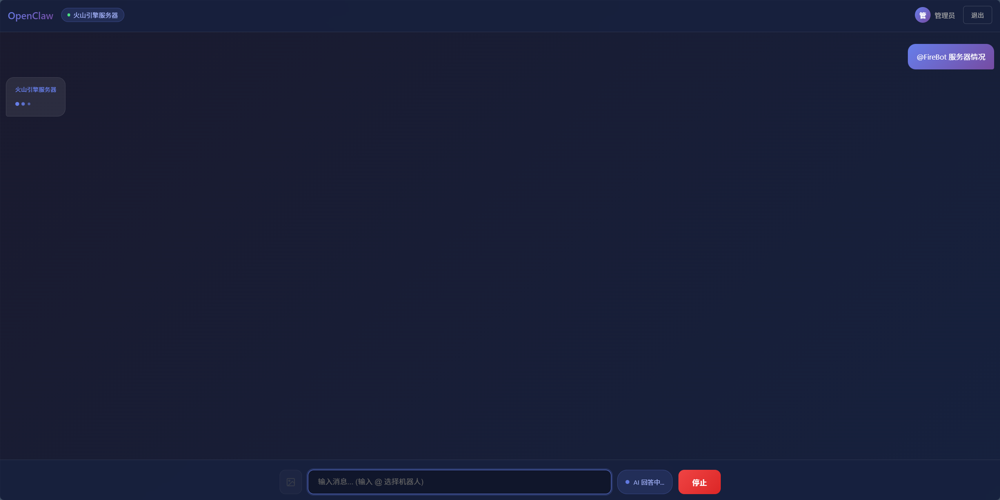
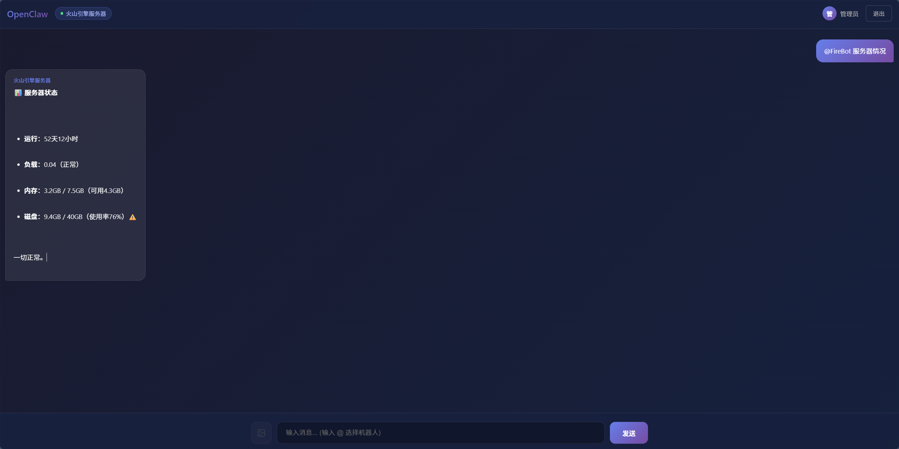

# OpenClaw Nexus

[](https://www.npmjs.com/package/@houchenyang/nexus-gateway)
[](https://github.com/hcy050617/openclaw-nexus)
[](https://opensource.org/licenses/MIT)

中文 | [English](./README_EN.md)

AI 对话转发网关 - 解决国内企业级 IM 应用额度限制问题。


## 痛点

在国内使用 AI 助手对接企业级 IM（如飞书、钉钉、企业微信）时，常常面临：

- **API 调用额度限制** - 各平台对机器人消息有频率限制
- **多平台重复开发** - 每个平台需要单独对接
- **会话管理困难** - 无法统一管理多个 AI 机器人

## 解决方案

OpenClaw Nexus 提供了一个统一的网关层：

```
飞书/钉钉/企业微信          OpenClaw Nexus Gateway          AI 服务
       用户  ─────────>  [认证 + 转发 + 负载均衡]  ─────────>  Bot
```

## 项目结构

```
nexus/
├── nexus-gateway/        # 网关服务端
│   ├── src/              # 源代码
│   ├── public/           # Web 聊天界面
│   └── config.json       # 配置文件
├── extensions/nexus/     # OpenClaw 客户端插件
│   └── src/              # 插件源代码
└── web-chat/             # 独立 Web 聊天页面
```

## 快速开始

### 1. 安装网关

```bash
# 使用 npm
npm install -g @houchenyang/nexus-gateway
nexus-gateway

# 或使用 npx
npx @houchenyang/nexus-gateway
```

### 2. 配置

编辑 `config.json`：

```json
{
  "port": 17392,
  "botToken": "your-secret-token",
  "users": {
    "admin": {
      "password": "your-password",
      "displayName": "管理员"
    }
  }
}
```

### 3. 访问 Web 界面

启动后访问 `http://localhost:17392` 即可使用内置的 Web 聊天界面。

### 4. 连接 OpenClaw

安装 OpenClaw 插件并配置连接：

```bash
openclaw plugins install @houchenyang/nexus
openclaw config set channels.nexus.serverUrl "ws://your-server:17392/bot-ws"
openclaw config set channels.nexus.botId "my-bot"
```

## 特性

- **用户认证** - 基于 Token 的会话管理
- **多 Bot 管理** - 支持多个 AI Bot 同时在线
- **流式输出** - 支持 SSE 流式响应
- **Web 界面** - 内置 Markdown 渲染的聊天界面
- **心跳保活** - 自动检测 Bot 在线状态
- **负载均衡** - 自动分发请求到可用 Bot

## 架构

```
┌─────────────────────────────────────────────────────┐
│                    Web 用户                          │
│            (浏览器 / 飞书 / 钉钉 / 企微)              │
└───────────────────────┬─────────────────────────────┘
                        │ HTTP/SSE
                        ▼
┌─────────────────────────────────────────────────────┐
│               Nexus Gateway                          │
│  ┌─────────┐  ┌─────────┐  ┌─────────────────────┐  │
│  │ 认证    │  │ 会话    │  │ 负载均衡            │  │
│  │ 模块    │  │ 管理    │  │ & 消息转发          │  │
│  └─────────┘  └─────────┘  └─────────────────────┘  │
└───────────────────────┬─────────────────────────────┘
                        │ WebSocket
                        ▼
┌─────────────────────────────────────────────────────┐
│                   AI Bots                            │
│   ┌─────────┐   ┌─────────┐   ┌─────────┐          │
│   │ Bot 1   │   │ Bot 2   │   │ Bot N   │          │
│   │ Claude  │   │ GPT     │   │ ...     │          │
│   └─────────┘   └─────────┘   └─────────┘          │
└─────────────────────────────────────────────────────┘
```

## 文档

- [网关服务端文档](./nexus-gateway/README.md)
- [客户端插件文档](./extensions/nexus/README.md)

## 开发

```bash
# 克隆项目
git clone https://github.com/hcy050617/openclaw-nexus.git
cd openclaw-nexus

# 安装依赖
cd nexus-gateway && pnpm install && pnpm build
cd ../extensions/nexus && pnpm install && pnpm build

# 启动开发服务器
cd nexus-gateway && pnpm dev
```

## 贡献

欢迎提交 Issue 和 Pull Request！

## 许可证

[MIT License](./LICENSE)
